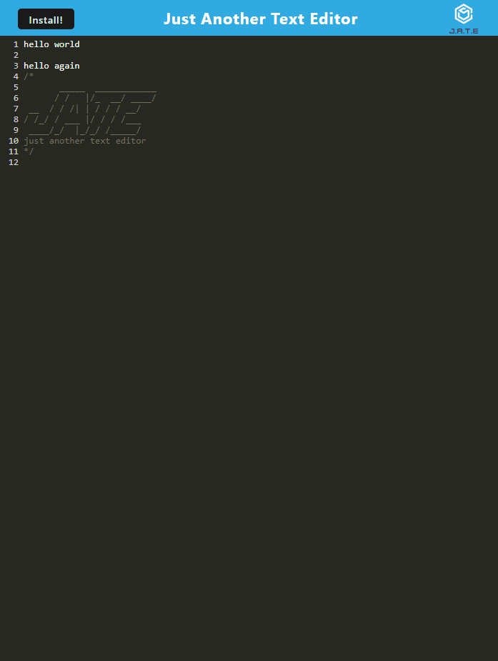

# PWA Text Editor
## About
Jate, or Just Another Text Editor, is a progressive web application users can run in their browser, or install for offline use. 
For this progressive web application, I was given starter code and had to update the service worker, database, and install, and web-pack. In the web-pack, I installed the plugins. For install.js I added code to hide the install button. In database.js, I updated routes. In my service worker file, I updated the register route and enabled plugins.
## Screenshots

## Link to Live Site
[Link to depolyed site on Heroku](https://pwa-text-editor-ap.herokuapp.com/)